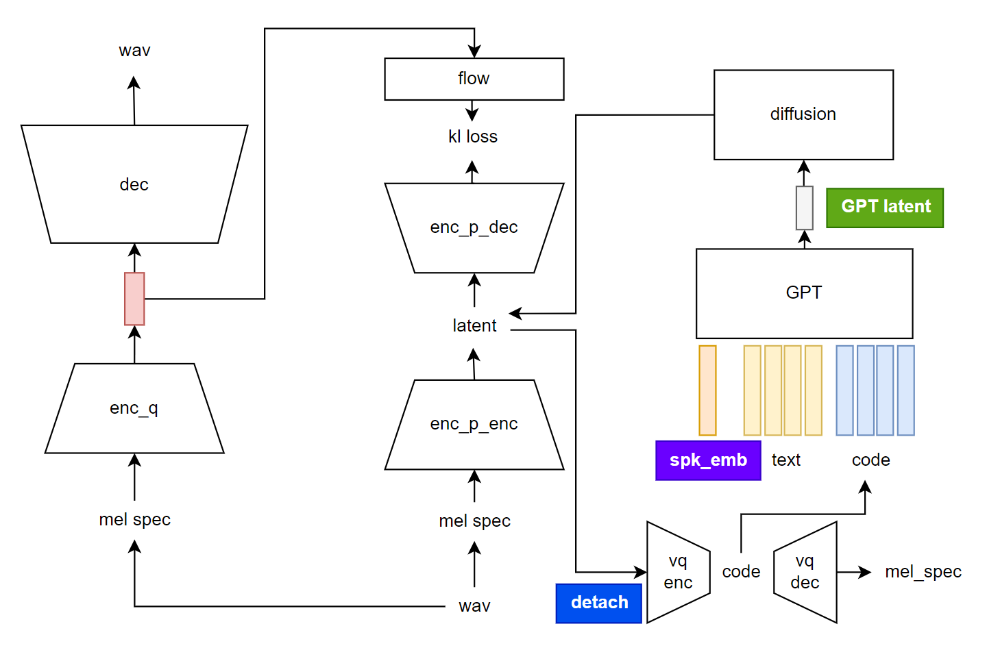

# Detail TTS

The model newly proposed three significant important methods to become the best practice of AR TTS.

- Although RVQ is used, the actual training employs continuous features, I call it fake discretization.
- All in one model. The model contains gpt, diffusion, vqvae, gan and flowvae all in one. One train one inference.
- Both prefixed spk emb and prompt are used to get benefit from both Valle type inference and Tortoise type training.



Here is the result obtained after the model was trained on 10000 hours of very dirty data. The model can be easily scaled up with many low quality data.

prompt 0

https://github.com/user-attachments/assets/8e592fab-7ef1-4c86-946b-4b9bf3d72eb7

generated 0

https://github.com/user-attachments/assets/e0d18f97-e32c-4645-9fd0-224edba8c13c

prompt 1

https://github.com/user-attachments/assets/18f86e1b-2185-4439-9bc4-07055393e4ef

generated 1

https://github.com/user-attachments/assets/2c43d174-5807-42ef-b4ea-3dfde3e09255


prompt 2

https://github.com/user-attachments/assets/c9a6c0ce-542a-44b6-a865-f24eb275c4d0

generated 2

https://github.com/user-attachments/assets/29045f4e-f3d0-4f70-959c-79b87b47b228

## Inference

check `api.py`

## Dataset prepare

Change the path contains audios in script and run

```
python prepare/0_vad_asr_save_to_jsonl.py
```

## Train and Fine Tune

```
accelerate launch train.py
```

For fine tuning, change the pretrain model load path.

## Acknowledgements

VQ and VITS from [GSV](https://github.com/RVC-Boss/GPT-SoVITS)

Diffusion and GPT from [tortoise](https://github.com/neonbjb/tortoise-tts)
